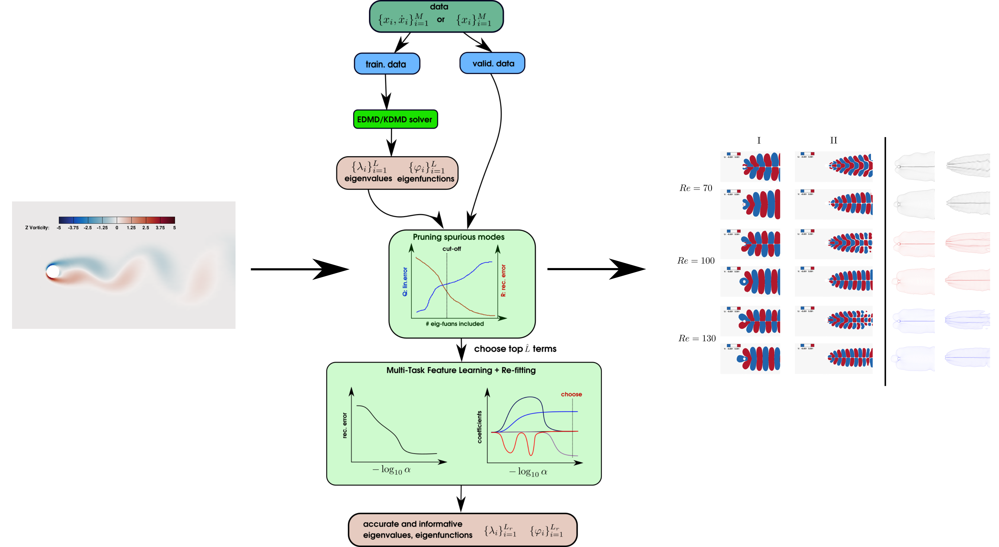

<!--
*** Thanks for checking out this README Template. If you have a suggestion that would
*** make this better, please fork the repo and create a pull request or simply open
*** an issue with the tag "enhancement".
*** Thanks again! Now go create something AMAZING! :D
***
***
***
*** To avoid retyping too much info. Do a search and replace for the following:
*** github_username, repo_name, twitter_handle, email
-->


<!-- PROJECT SHIELDS -->
<!--
*** I'm using markdown "reference style" links for readability.
*** Reference links are enclosed in brackets [ ] instead of parentheses ( ).
*** See the bottom of this document for the declaration of the reference variables
*** for contributors-url, forks-url, etc. This is an optional, concise syntax you may use.
*** https://www.markdownguide.org/basic-syntax/#reference-style-links
-->


# SKDMD
Sparsity-promoting Kernel Dynamic Mode Decomposition for our paper on [JFM](https://www.cambridge.org/core/journals/journal-of-fluid-mechanics/article/sparsitypromoting-algorithms-for-the-discovery-of-informative-koopmaninvariant-subspaces/F52F03ED181023369A661EF09B57281A)
This paper is open access so anyone can download for free.

## Table of Contents

* [Motivations](#motivations)
* [Getting Started](#getting-started)
  * [Prerequisites](#prerequisites)
* [Usage](#usage)
* [Roadmap](#roadmap)
* [Contributing](#contributing)
* [License](#license)
* [Contact](#contact)
* [Citation](#cite)


## Motivations

- **Why throwing everything in a neural network?**
  - neural network approach for finding Koopman operators could suffer from bad minimizers, time consuming (requires a quite large number of GPU training hours), which are all resulted from the non-convex optimization nature 

- **Why not using classical convex methods?**
  - classical nonlinear Koopman analysis method (e.g., EDMD, KDMD) suffers from having hundreds to thousands of **approximated Koopman triplets**. 
  - How to choose an **accurate** and **informative** Koopman invariant subspace in Extended/Kernel DMD?

- **Traditional linear DMD performs poorly on transient flows**
  - due to inherent linear nature, sparsity-promoting DMD (Jovanovic, et al., 2014) cannot provide accurate representation for Koopman mode decomposition in a transient regime. 
  - due to lack of truncation on nonlinearly evolving modes, **spDMD can end up with spurious unstable Koopman modes for stable flows**.

- **Not every nonlinear dynamical system requires a neural network to search for Koopman operator**
  - we resolve the issue of classical methods by rethinking modes selection in EDMD/KDMD as a *multi-task learning* problem
  - demonstration on several strongly transient flows shows the effectiveness of the algorithm for providing an accurate reduced-order-model (ROM) 

- **KDMD can be expensive to computationally evaluate (online)/train (offline)**
  - due to **cubic complexity** in the linear system step (although no one actually performs inverse exactly, but for forward computation it is inevitable)
  - we implement **random Fourier features** as a way to approximate kernel methods efficiently while enjoying the benefits of EDMD



## Getting Started

### Prerequisites
- python3
- scipy
- numpy
- scikit-learn
- pyDOE
- mpi4py


<!-- USAGE EXAMPLES -->
## Usage

###  Example: KDMD on 2D cylinder flow past cylinder

#### Selection of hyperparameter

- go to `EXAMPLE/cylinder_re100/hyp` 
- run parallem hyperparameter selection with `4` processes
  - ```mpirun -np 4 python3 cv_kdmd_hyp_20d_cyd.py```
- then collecting the result and draw the figure by
  - ```python3 print.py```
- the resulting figure `result-num.png` is a good refernce of choosing hyperparameter

#### Run SPKDMD 

- go to `EXAMPLE/cylinder_re100` folder

- run a standard KDMD default parameters

  - ```python3 example_20d_cyd.py ```

- perform multi-task learning mode selection
  - note that in `run_apo_cyd_ekdmd.py`, the`max_iter = 1e5` is a **very conservative** choice for getting accurate result, one can choose `max_iter=1e2` to just get a good result of the algorithm
  - ```python3 run_apo_cyd_ekdmd.py ```
  
- postprocessing the result of multi-task learning
  - ```python3 pps_cyd.py```

- Note: that the data is top 20 POD coefficients with mean-subtracted.


<!--
### Example: scalable EDMD on 12d flexible joint system

- go to `EXAMPLE/12d_flex_mani` folder

- run the EDMD with random Fourier features
  - ```python3 example_12d_flex_mani.py ```

- following the similar tasks in first example. 
-->

###  Example: Simple toy 2D ODE system

- similarly just go to folder `EXAMPLE/lusch`

<!-- ROADMAP -->
## Roadmap

See the [open issues](https://github.com/pswpswpsw/SKDMD/issues) for a list of proposed features (and known issues).

### Current Limitations

- as it is designed for modal analysis, the error-checking framework is only working on analyzing one single trajectory
   
    - can be easily generalized to multiple validation trajectories. Just modify the code with several other validation trajectories.

- the standard multi-task solver `sklearn.linear_model.MultiTaskElasticNet` is okay for trajectory with around 100 to 1000 data points, while can be expensive for higher number of snapshots. However, the number of snapshots for most high-fidelity CFD datasets is no more than 1000 snapshots. It should be further improved by using ideas from variational projection:

    - Askham, Travis, and J. Nathan Kutz. "Variable projection methods for an optimized dynamic mode decomposition." SIAM Journal on Applied Dynamical Systems 17.1 (2018): 380-416.
    - Erichson, N. Benjamin, et al. "Sparse principal component analysis via variable projection." SIAM Journal on Applied Mathematics 80.2 (2020): 977-1002.

<!-- CONTRIBUTING -->
## Contributing

Contributions are what make the open source community such an amazing place to be learn, inspire, and create. Any contributions you make are **greatly appreciated**.

1. Fork the Project
2. Create your Feature Branch (`git checkout -b feature/AmazingFeature`)
3. Commit your Changes (`git commit -m 'Add some AmazingFeature'`)
4. Push to the Branch (`git push origin feature/AmazingFeature`)
5. Open a Pull Request


<!-- LICENSE -->
## License

Distributed under the MIT License. See `LICENSE` for more information.


<!-- CONTACT -->
## Contact

Shaowu Pan - email: shawnpan@umich.edu

Project Link: [https://github.com/pswpswpsw/SKDMD](https://github.com/pswpswpsw/SKDMD)

## Citation


    @article{pan2021sparsity,
    title={Sparsity-promoting algorithms for the discovery of informative Koopman-invariant subspaces},
    author={Pan, Shaowu and Arnold-Medabalimi, Nicholas and Duraisamy, Karthik},
    journal={Journal of Fluid Mechanics},
    volume={917},
    year={2021},
    publisher={Cambridge University Press}
    }
